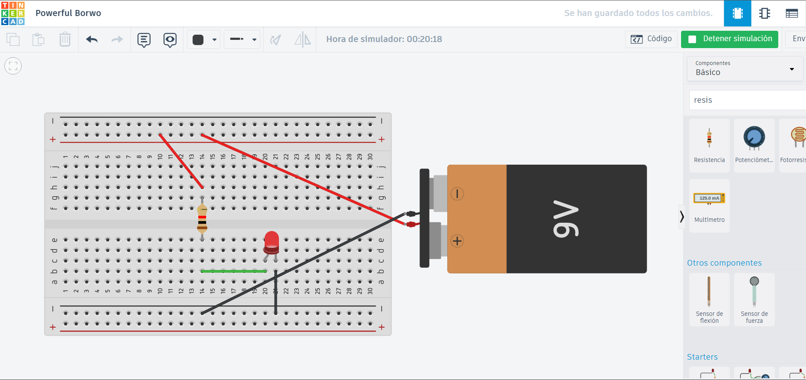

# sesion-01b

Tienes que saber amarte, para amar a otros - Aarón Montoya

---

Know how and Know what.

Por ahora estan explicando el flujo de energia con una metafora de flores y agua 

- High: (H) Parte de una proporcionalidad para el flujo de la energia

- Corriente/ Current: (I) intensidad de corriente *Ampers*

- Resistencia (R) *OHM*

- Voltaje (V) : Diferencial de potencial (este es un sinonimo) *Volts*

*La corriente es igual al voltaje dividido en la resistencia: Como tal es proporcional o explota todo*

LED: La pata larga es la positiva y la corta es la negativa 

Rafael Benguria: es un físico-matemático chileno, Premio Nacional de Ciencias Exactas de 2005 por sus investigaciones en Física Matemática, y actual profesor de la Pontificia Universidad Católica de Chile

---

Documental: La Historia de Aaron Swartz | El chico de Internet/ The Internet's Own Boy - Aaron Swartz

*Si alguien de casualidad ve esto antes de la entrega por curiosidad: https://kolektiva.media/w/eHxTApxsZ4eeVy1mJmnZKg*

## Apuntes:

Empezamos fuerte...
El cofundador de Reddit fue hallado muerto (nuestro protagonista)

Por lo que su famila puede proporcionar, Aaron fue bastante inteligente desde pequeño, aprendiendo a leer a una corta edad.

Tanto fue esta inteligencia que con sus hermanos programaron un juego de preguntas y una pagina web con el mismo razonamiento de wikipedia antes de que esta misma existiera y con tan solo 12 años. Ganando un concurso de paginas web y todo

Con los años se unio a diferentes grupos onlines sobre paginas webs y se le subio un poco el ego por ello.

El programa en el cual estaba involucrado se llamaba: RSS
Tambien con el desarrollo temprano de Reddit y el movimiento CC (Creative Commons)

Con nuevos conocimientos Aaron fue creciendo, volviendose un activista que defendia la idea de que el conocimiento debe compartirse gratuitamente por el mundo

*Esto me recuerda mucho a una frase "Culture shouldn't exist only for those who can afford it". Fue de un desarrollador de Ultrakill*

Al pasar el documental se deja ver en cuales movimientos estaba a favor de la libertad en Internet y su oposicion como a la ley SOPA

Para su causa en 2011 Swartz descargó millones de articulos academicos para liberar este conocimiento al publico, pero con ello fue acusado de fraude informatico con una alta condena.

Y ya para 2013 terminamos donde comenzamos, con su muerte y su legado.

